# > ELI5 for Web3 🤖

**➡️ This project is a submission to the EDU Chain Hackathon: Semester 1👨‍💻**

 

 <strong> ✨ ELI5 for Web3 🔥 </strong> 

 

## Introduction

Feeling lost in all the blockchain talk on X? Struggling to keep up with the endless new projects and confusing ideas? You're not alone. The world of Web3 can be really hard to understand, but we've got the perfect solution for you.

Introducing "ELI5 for Web3"! We make complicated blockchain topics easy to understand with simple and fun explanations. No more confusion or feeling overwhelmed. With our help, you'll get a clear and easy grasp of Web3 in no time. Say goodbye to the confusion and hello to understanding with "ELI5 for Web3".

Btw, if you don't know: **ELI5 means "Explain like I'm Five"**

### Problem

Blockchain concepts are notoriously hard to understand. Every day, new projects introduce even more complex ideas, making it increasingly difficult for people to grasp what’s happening in the Web3 space. This leads to a cycle of confusion:

### Solution

To break this cycle, I created "ELI5 for Web3." Our goal is to simplify these complex blockchain concepts and Web3 projects. By providing easy-to-understand explanations, we aim to make Web3 accessible to everyone:

With "ELI5 for Web3," we turn intricate and confusing blockchain topics into clear and concise explanations, helping users quickly grasp and appreciate the world of Web3. 

## Features

👉🏻 Connect with OCID to access the application.
➡️ One time Name & Email require to access the Application.  
🎯 Personalized answers for community & developers.  
🕒 Real-time updates from Internet.  
👨‍💻 Chat via CUI (Conversational User Interface).  
🎤 Voice functionality for easy interaction.  
👍 Provide Feedback.  
☑️12 Limit Messages per 24 hours.  

## Benefits

🌟 Enhances community & developer experience.  
📰 Keeps the Web3 community informed.  
🌐 Makes Web3 more accessible.  
📈 Assist greater engagement and Web3 space development.  

## Tech Stack

- **Open Campus ID SDK**: To connect/login the users with the open campus ecosystem.
- **OpenAI Assistant APIs**: Powers the natural language processing abilities to deliver accurate responses and maintain a conversational style with (function calling, code interpreter, and file search).
- **FlowiseAI**: Customized LLM orchestration flow tool.
- **Next.js, TypeScript, TailwindCSS**: Provides a seamless, dynamic user interface with a consistent design.
- **OpenAI GPT-4o and Moderation APIs**: Handles advanced chatbot responses and content moderation.
- **Google Custom Search API**: Allows the chatbot to fetch relevant information online to provide up-to-date answers.
- **Custom Training Data with Prompt Engineering**: Ensures precise responses through well-crafted prompts and curated data.
- **OpenAI Whisper API for Speech-to-Text**: Supports speech recognition to deliver a multi-modal experience.
- **LangSmith API for Chatbot Analysis**: Analyzes chatbot interactions for optimization and refinement.

### **=> How Everything is Connected? (FlowChart)**

- [Flowise Github Repositry](https://github.com/flowiseai/flowise) (Deployed on Render & Connected to Chatbot UI via APIs programmatically).
- [FlowiseChatEmbed Github Repositry](https://github.com/flowiseai/FlowiseChatEmbed) (UI/UX of Chatbot, Connected via CDN)

 

 <strong> ✨ ELI5 for Web3 FlowChart 🔥 </strong> 

### **=> (Behind the Scene) Flowise Flow Of ELI5**
 

 <strong> ✨ Flowise Flow of ELI5 for Web3 🔥 </strong> 

## Live Hosted web app of "ELI5 for Web3"

➡️ **[CodeBase](./)**  
➡️ **[Web App](https://eli5forweb3.vercel.app/)**  
➡️ **[Prompt used for Assistant Training](./prompt-engineering/prompt.md)**  

## Future Improvements

**Expanded Knowledge Base:** Improve the ***ELI5 for Web3*** by incorporating additional Blockchain resources data to provide more comprehensive and technical answers into simple words. 

**Enhance Community Analytics:** Access real-time community sentiment about the Blockchain projects through metrics from X and other social platforms for multiple use cases. 